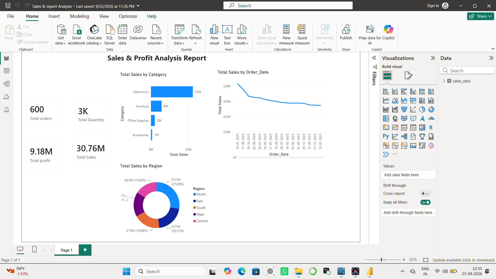

# Sales & Profit Analysis Dashboard

### Tools Used: Power BI | MySQL

### Project Overview:
Analyzed 600 orders, 3K quantity, 30.76M sales.

### Dashboards:
- Total Sales by Category
- Total Sales by Order Date  
- Total Sales by Region

### SQL Queries Done:
- Total Sales, Profit, Quantity
- Sales by Category, Region, Product
- Monthly Sales Trend

### Files:
- sales_dashboard.pbix - Power BI File
- sales_queries.sql - SQL File
- dashboard.png - Screenshot
- ### Dashboard Preview:

